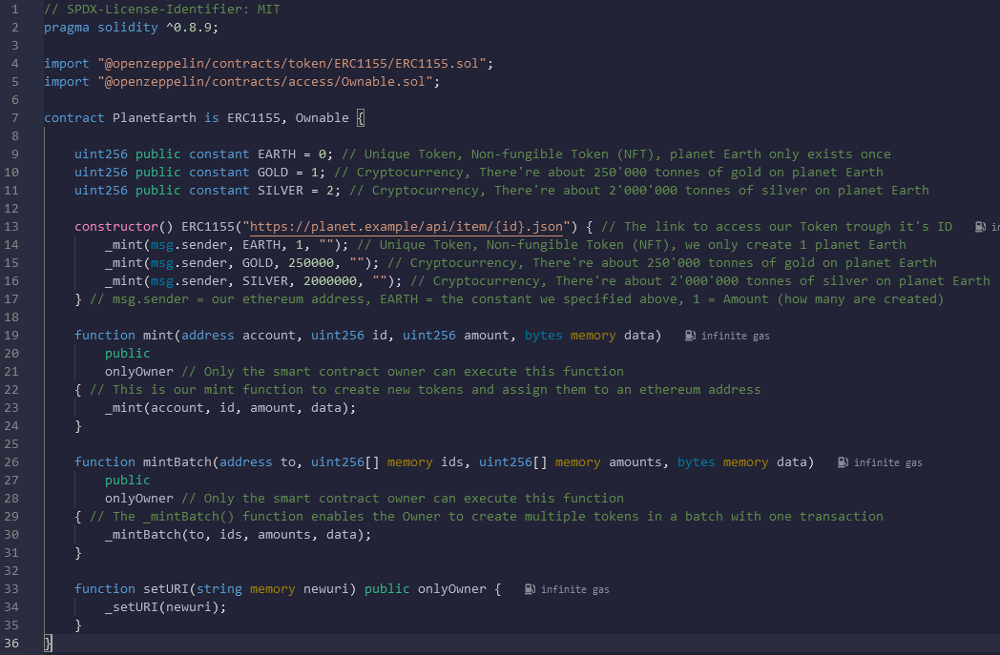

# 🌎 Simple ERC 1155 Multi Token Template 🌏
🌎 Very Simple ERC-1155 Smart Contract Template to create your own ERC-1155 Tokens on the Ethereum Blockchain, with many customizable options 🌏

## 💎 What is ERC-1155? 💎
**ERC-1155** is a free, open standard that describes how to build tokens and non-fungible or unique tokens (NFT) on the Ethereum blockchain. It can create fungible tokens (every token is the same as every other token), and non-fungible or unique tokens (NFT) where tokens are unique.

**ERC-1155** has a huge advantage when it comes to transaction costs, because you're able to create multiple non-fungible (NFT) and fungible tokens in one transaction, you can also send the tokens in one single transaction as a batch, fewer transactions = less transactions cost.

## ⚙️ Setup ⚙️

Each Line of the **Solidity Code** has a comment that explains what is happening. 📝 

The Setup is fairly easy, you just need to click on the [Remix link](https://remix.ethereum.org/#version=soljson-v0.8.19+commit.7dd6d404.js&optimize=false&gist=9ea36647220e2982ca55cf179bd98f81&lang=en&runs=200&evmVersion=null&language=Solidity) or use the [Gist link](https://gist.github.com/AYIDouble/9ea36647220e2982ca55cf179bd98f81) and you're done. </br>
If you have problems with it, you can also do it the good old way and add each file separately. (Takes about 1 minute)

Remix IDE Link: https://remix.ethereum.org/#version=soljson-v0.8.19+commit.7dd6d404.js&optimize=false&gist=9ea36647220e2982ca55cf179bd98f81&lang=en&runs=200&evmVersion=null&language=Solidity

GitHub Gist Link: https://gist.github.com/AYIDouble/9ea36647220e2982ca55cf179bd98f81

## [📝 Remix - Solidity IDE  📝](https://remix.ethereum.org/#version=soljson-v0.8.19+commit.7dd6d404.js&optimize=false&gist=9ea36647220e2982ca55cf179bd98f81&lang=en&runs=200&evmVersion=null&language=Solidity)



## 🌎 PlanetEarth.sol 🌏 (ERC-1155 Token)

In this small example, we are creating an ERC-1155 Token with a non-fungible token (Earth) and fungible Tokens (Gold & Silver). 🌎

**Example: Our planet Earth is saved as a non-fungible token (NFT) with gold and silver as fungible tokens (cryptocurrency) in the Ethereum Blockchain.**
```
// SPDX-License-Identifier: MIT
pragma solidity ^0.8.9;

import "@openzeppelin/contracts/token/ERC1155/ERC1155.sol";
import "@openzeppelin/contracts/access/Ownable.sol";

contract PlanetEarth is ERC1155, Ownable {

    uint256 public constant EARTH = 0; // Unique Token, Non-fungible Token (NFT), planet Earth only exists once
    uint256 public constant GOLD = 1; // Cryptocurrency, There're about 250'000 tonnes of gold on planet Earth
    uint256 public constant SILVER = 2; // Cryptocurrency, There're about 2'000'000 tonnes of silver on planet Earth

    constructor() ERC1155("https://planet.example/api/item/{id}.json") { // The link to access our Token trough it's ID
        _mint(msg.sender, EARTH, 1, ""); // Unique Token, Non-fungible Token (NFT), we only create 1 planet Earth
        _mint(msg.sender, GOLD, 250000, ""); // Cryptocurrency, There're about 250'000 tonnes of gold on planet Earth
        _mint(msg.sender, SILVER, 2000000, ""); // Cryptocurrency, There're about 2'000'000 tonnes of silver on planet Earth
    } // msg.sender = our ethereum address, EARTH = the constant we specified above, 1 = Amount (how many are created)

    function mint(address account, uint256 id, uint256 amount, bytes memory data)
        public
        onlyOwner // Only the smart contract owner can execute this function
    { // This is our mint function to create new tokens and assign them to an ethereum address
        _mint(account, id, amount, data);
    }

    function mintBatch(address to, uint256[] memory ids, uint256[] memory amounts, bytes memory data)
        public
        onlyOwner // Only the smart contract owner can execute this function
    { // The _mintBatch() function enables the Owner to create multiple tokens in a batch with one transaction
        _mintBatch(to, ids, amounts, data);
    } 

    function setURI(string memory newuri) public onlyOwner {
        _setURI(newuri);
    }
}
```

## ❔ What's the difference between a non-fungible (NFT) and a fungible token in ERC-1155? ❔

In **ERC-1155** a non-fungible (NFT) gets only created once and is unique, and fungible tokens are created more than once, like a cryptocurrency.
That's it, it's very simple, here's a code example where non-fungible (NFT) and fungible tokens are created:

```
// A non-fungible (NFT) Token, created only once, the NFT planet Earth is unique and only exists once
_mint(msg.sender, EARTH, 1, ""); // Unique Token, Non-fungible Token (NFT), we only create 1 planet Earth

// Fungible tokens, created multiple times (250'000 gold and 2'000'000 silver tokens), all gold or silver tokens are identical
_mint(msg.sender, GOLD, 250000, ""); // Cryptocurrency, There're about 250'000 tonnes of gold on planet Earth
_mint(msg.sender, SILVER, 2000000, ""); // Cryptocurrency, There're about 2'000'000 tonnes of silver on planet Earth
```


